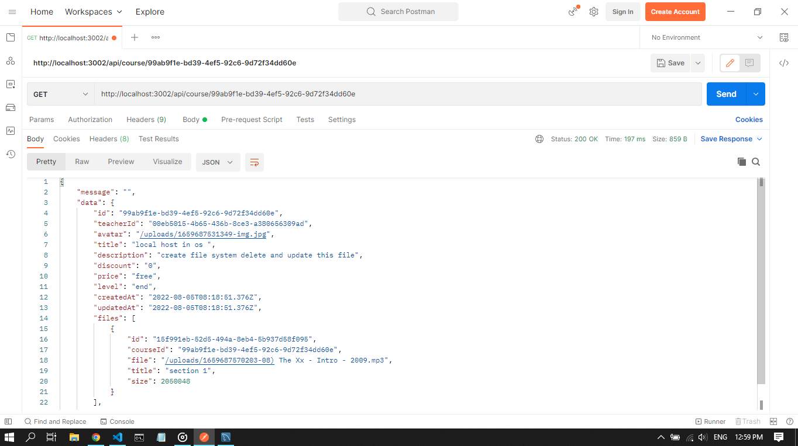

# Educational app using node js

## packages 
backend : 

- node js 
- express js 
- typescript 
- prisma 
- jsonwebtoken 
- express-validator 
- bcrypt 
- lodash 
- morgan 
- dotenv 
- mkdirp 
- multer 
- config 

fronend : 

- react js 
- bootstrap 
- updating ..... 

## About 

hello there 
In this repository I tried to create api of educational website\

My focus has been on apis

This api creates, edits or deletes users

Some tasks are on the admin's shoulders

If a user has an admin flag in the system, he can create a course and add parts of the courses to the courses

Update, delete or create courses

Users can post their comments under the courses and view the courses
Course data:

