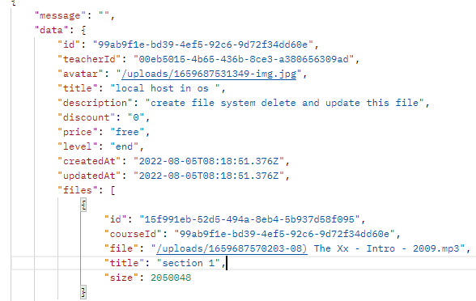

# Educational app using node js

## packages 
backend : 

- node js 
- express js 
- typescript 
- prisma 
- jsonwebtoken 
- express-validator 
- bcrypt 
- lodash 
- morgan 
- dotenv 
- mkdirp 
- multer 
- config 

frontend : 
- trying to create 

## About 

hello there\
In this repository I tried to create api of educational website.\
My focus has been on apis.\
This api creates, edits or deletes users.\
Some tasks are on the admin's shoulders.\
If a user has an admin flag in the system, he can create a course and add parts of the courses to the courses.\
Users can post their comments under the courses and view the courses.

Course data :\

### Implemented endpoints:
>Note: APIs start with the /api path (for Example : /api/auth/register )
#### /auth 
Path | Method | Description
---|---|--- 
/auth/register | POST | Register Action
/auth/login | POST | Login Action

#### /profile 
>Note: To continue, it must be authenticated and send the token in the requests header (set header : {'x-auth-token : your-token})
Path | Method | Description
---|---|--- 
/profile/ | GET | Read User 
/profile | PUT | Update infotmation [name , bio]
/avatar | PUT | Add avatar (Content-type : multipart/form-data)
/avatar | DELETE | Delete avatar 

#### /Course

Path | Method | Description
---|---|--- 
/course | GET | Read all courses 
/course/:id | GET | Read course by id
/course | POST | Create cousre (required admin flag) (Content-Type:multipart/form-data)
/course/:id | PUT | Update course (required admin flag) (Content-Type:multipart/form-data)
/course/:id | DELETE | Delete Course (required admin flag) 
/course/:id/file/ | POST / Create course sections use course id (reuired admin flag) (Content-Type:multipart/form-data)
/course/file/:id | DELETE / Deleted course section use file id (reuired admin flag)

#### /user

Path | Method | Description
---|---|--- 
/user | GET | Read all user (required admin flag)
/user/:id | GET | Read user using id (required admin flag)
/user | POST | Create User (required admin flag)
/user/:id | PUT | Update User (required admin flag)
/user/:id | DELETE | Delete user (required admin flag)

#### /Comment
>Note : To continue, it must be authenticated .
Path | Method | Description
---|---|--- 
/comment/:id | POST | Add comment to course using course id 
/comment/:id | DELETE | Delete comment usin comment id 

